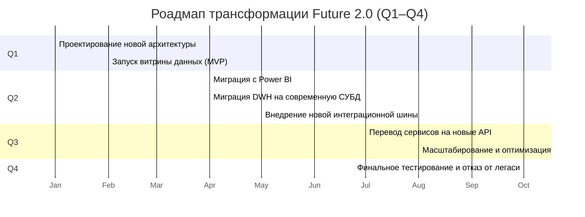

## Роадмап трансформации Future 2.0

## Обоснование этапов роадмапа

### Q1:
Проектирование архитектуры и быстрый запуск MVP витрины данных — чтобы сразу получить обратную связь и заложить
фундамент для изменений.

### Q2:
Начинается миграция BI и DWH, а также внедрение новой интеграционной шины — эти процессы можно запускать параллельно,
чтобы ускорить переход.

### Q3:
Перевод сервисов на новые API и масштабирование новых решений на большее число доменов и пользователей.

### Q4:
Финальное тестирование, оптимизация и полный отказ от легаси-систем.