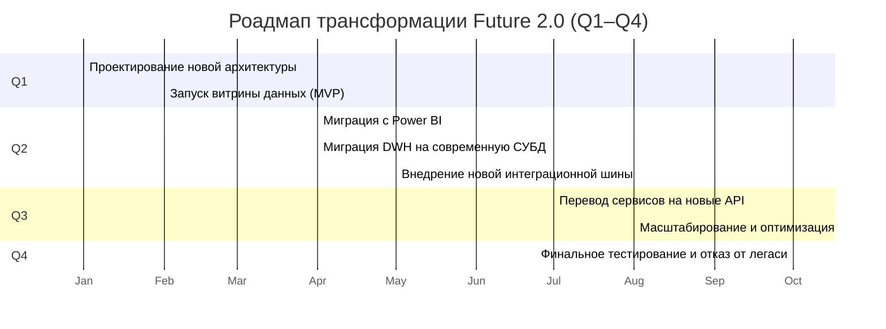

## Роадмап трансформации Future 2.0

## Детализация этапов роадмапа
| Этап | Результат | Ответственные команды | Ресурсы, которые потребуются |
| --- | --- | --- | --- |
| Проектирование новой архитектуры | Архитектурная схема, утверждённый план миграции | Архитектор, CTO, бизнес-аналитики | Время экспертов, рабочие сессии, консультации с бизнесом |
| Запуск витрины данных (MVP) | Рабочий портал для аналитики, первые отчёты | BI-команда, backend-разработчики | Серверы/облако, лицензии BI, тестовые данные |
| Миграция с Power BI | Перенос отчётов и дашбордов, отказ от Power BI | BI-команда, data-инженеры | Доступ к старым и новым BI-инструментам, обучение пользователей |
| Миграция DWH на современную СУБД | Новый DWH, отказ от SQL Server 2008 | Data-инженеры, DevOps | Серверы/облако, лицензии на СУБД, инструменты миграции |
| Внедрение новой интеграционной шины | Новая шина (Kafka/RabbitMQ), документация по интеграции | DevOps, интеграционная команда | Серверы/облако, лицензии, обучение, пилотные проекты |
| Перевод сервисов на новые API | REST API, OpenAPI-спецификации, документация | Backend-команды, интеграторы | Время разработчиков, инструменты тестирования, документация |
| Масштабирование и оптимизация | Увеличение нагрузки, оптимизация процессов | Все команды | Мониторинг, CI/CD, автоматизация, поддержка пользователей |
| Финальное тестирование и отказ от легаси | Протоколы тестирования, финальный отчёт, отключение легаси | QA, DevOps, архитекторы | Тестовые среды, чек-листы, поддержка пользователей |

## Обоснование этапов роадмапа

### Q1:
Проектирование архитектуры и быстрый запуск MVP витрины данных — чтобы сразу получить обратную связь и заложить
фундамент для изменений.

### Q2:
Начинается миграция BI и DWH, а также внедрение новой интеграционной шины — эти процессы можно запускать параллельно,
чтобы ускорить переход.

### Q3:
Перевод сервисов на новые API и масштабирование новых решений на большее число доменов и пользователей.

### Q4:
Финальное тестирование, оптимизация и полный отказ от легаси-систем.