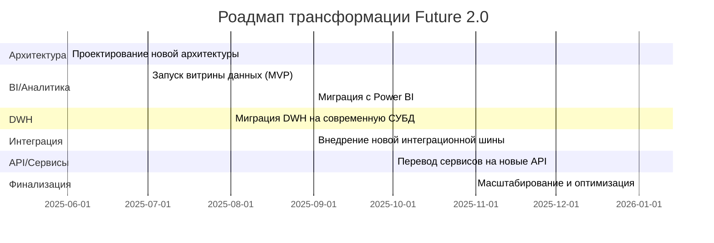

## Роадмап трансформации Future 2.0

## Обоснование этапов роадмапа
  1. Проектирование новой архитектуры
    С этого этапа начинается вся трансформация: нужно согласовать целевую архитектуру, выбрать технологии и спланировать миграцию. Это позволит избежать хаоса и лишних затрат на переделки.
  2. Запуск витрины данных (MVP)
    Быстрый запуск минимально жизнеспособной версии витрины позволит бизнесу сразу начать получать выгоду от новых инструментов аналитики и самообслуживания, а также собрать обратную связь.
  3. Миграция с Power BI
    Постепенный перенос аналитики и отчётов на новую витрину данных позволит отказаться от устаревших инструментов и ускорить построение отчётов.
  4. Миграция DWH на современную СУБД
    Перенос хранилища данных на современную платформу (например, PostgreSQL или ClickHouse) повысит производительность, упростит поддержку и откроет возможности для масштабирования.
  5. Внедрение новой интеграционной шины
    Переход на современную шину (Kafka, RabbitMQ) обеспечит надёжный и масштабируемый обмен данными между доменами и внешними компаниями.
  6. Перевод сервисов на новые API
    Обеспечит стандартизацию интеграций, упростит подключение новых сервисов и партнёров, снизит технический долг.
  7. Масштабирование и оптимизация
    Финальный этап — оптимизация архитектуры, отказ от легаси, масштабирование новых решений на всю компанию.